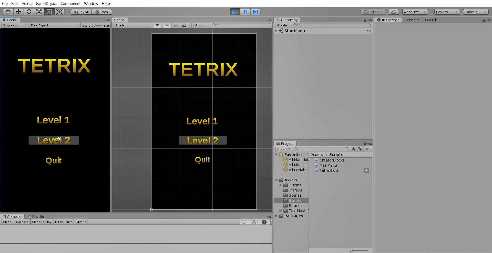
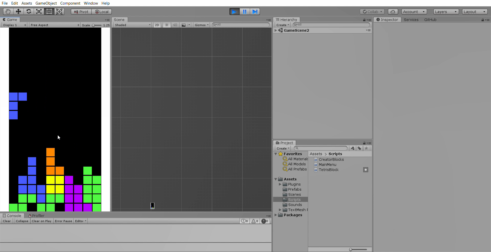

# Tetrix - Unity

Tetrix is a modern take on the classic Tetris game, developed using C# and Unity. This version features multiple levels with increasing difficulty.

## Screenshots

### Main Menu
_Main menu of Tetrix with selectable levels and a quit option._



### Gameplay
_Gameplay screenshot showcasing falling Tetrominoes._



## Features

- **Multiple Levels:** Begin with simpler blocks in Level 1 and challenge yourself with more complex patterns in Level 2.
- **Dynamic Gameplay:** Enjoy classic Tetris mechanics with a modern visual twist.
- **Intuitive User Interface:** The UI is designed for easy and simple navigation.

## Installation

To get started with Tetrix:

1. **Clone the repository:**
   ```bash
   git clone git@github.com:jrodriguezn19/Tetris_Unity.git

2. **Open the project in Unity:**
Make sure you have Unity 2020.x or newer installed.
Open Unity, navigate to the cloned repository directory and open the project.

3. **Build and Play:**
Press the play button in Unity to test the game or build it for your preferred platform.

## Controls
* Move Left/Right: Left Arrow / Right Arrow  
* Rotate Block (Clockwise): Up Arrow  
* Rotate Block (Counterclockwise): Down Arrow  
* Hard Drop: Spacebar  
* Pause Game: P
   
## Technical Details
* Programming Language: C#  
* Game Engine: Unity  
* Dependencies: Utilizes Unity's built-in components and libraries.  

[](https://hits.seeyoufarm.com)
